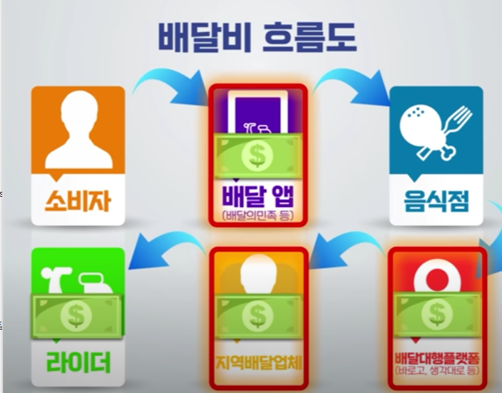

# delivery_cost_solution
- 배달 플랫폼의 배달비 후려치기 문제를 해결하기 위한 프로젝트

## 들어가며
이 프로젝트를 계획한 이유는 배민 1, 치타 배달, 쿠팡이츠 배달 플랫폼들 배달수요가 높아지는 것을 이용해
자영업자들이 사용할 수밖에 없는 환경을 만들고 높은 수수료, 중개료등 여러 비용을 요구하고 있기 때문입니다.

이는 자영업자와 배달 플랫폼이 공생하는 관계가 아니라 갑을관계로 전환되는 것이며 자영업자 죽이기라고도 말할 수 있습니다.
정부에서는 이미 배달 플랫폼 3사의 시장 흔들기를 막기 위해 서비스를 여러 차례 시도했지만 좋은 성과를 내지 못했습니다.

결론적으로 배달 플랫폼의 배달비 후려치기 문제를 해결하는 방법은 새로운 플랫폼의 탄생이 아니라
배달이용객들이 적은 불편을 감소하더라도 단합하는 것이며, 이 단합을 끌어내는 프로젝트가 필요하다고 생각했습니다.
## 문제 구체화 하기

문제를 구체화하기 위하여 아래와 같이 확장해보겠습니다.
1. 중간 업체를 뺴고 소비자-음식점-라이더를 연결시킬수는 없는가? ->

2. 정부가 실패한 이유에 막대한 서버비용과 유지보수가 있을것인데 이것을 해결할 수있는가?
-> 카카오톡의 오픈채팅을 활용해본다??..

3. 불편을 감소해야하는데 사용자들이 사용할 것인가??
-> 배달 플랫폼의 배달비 후려치기를 막는 방법은 사실 모두 알고있다.
'전화주문'인데 배달어플이 매우 편리하기 떄문에 사용하는 것이다.
해당 어플의 최대 기대값은 '소비자들이 불편을 조금 감소하더라도 배달플랫폼의 배달비 문제를 단합해서 해결하고자한다'
입니다. 따라서 전화주문보다 편리한 방법이지 배달어플의 편리성은 따라가지 못한다.